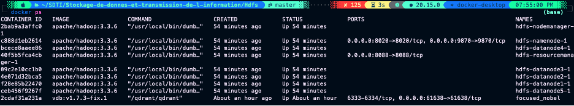
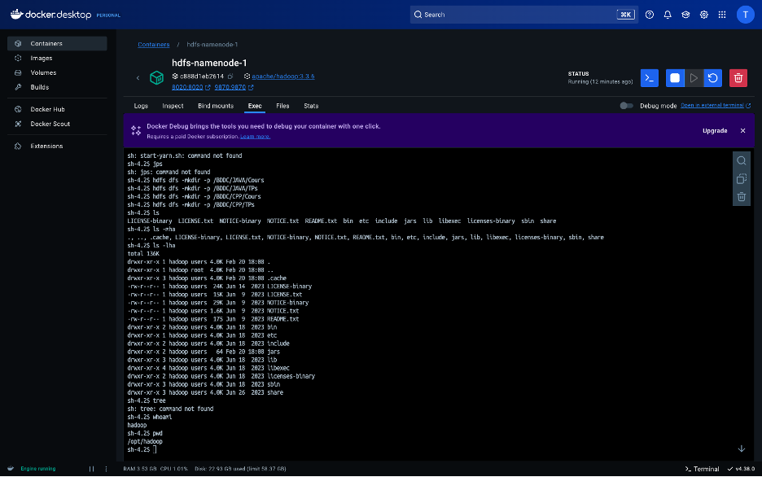
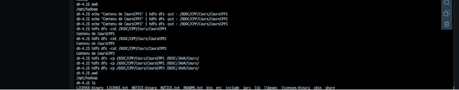
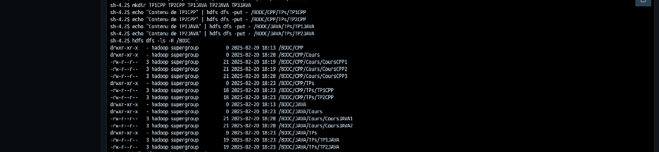

# Rapport TP1 : Manipulation du Système de Fichiers HDFS  

## **Mohamed Lakssir – 2ACI-Info**

---

## 1. Introduction

Ce rapport présente la manipulation du système de fichiers Hadoop (HDFS) dans un environnement local. L'objectif est d'apprendre à interagir avec HDFS en utilisant Docker Desktop sur macOS (MacBook Pro M2), via le terminal iTerm2 et le shell Fish. Les opérations réalisées couvrent la création d'une arborescence dans HDFS, la manipulation de fichiers (création, lecture, copie, suppression, renommage) ainsi que le transfert de fichiers entre le système local et HDFS.

*Capture d'écran de l'environnement (iTerm2, Docker Desktop, etc.) déjà insérée.*




---

## 2. Objectifs

Les objectifs de ce TP sont :

- Démarrer et vérifier les services Hadoop (HDFS et YARN) via Docker.
- Créer une structure d'arborescence dans HDFS adaptée aux cours de JAVA et de C++.
- Manipuler des fichiers dans HDFS (création, lecture, copie, suppression, renommage).
- Transférer des fichiers entre le système local et HDFS.
- Vérifier l'intégralité de l'arborescence HDFS de manière récursive.

---

## 3. Environnement de travail

- **Système d'exploitation** : macOS sur MacBook Pro M2  
- **Terminal** : iTerm2 avec Fish Shell  
- **Docker Desktop** : Conteneurs Docker pour Hadoop  
- **Hadoop** : Version 3.x (exécutée dans des conteneurs Docker)  
- **Java** : JDK 8 ou supérieur  
- **Configuration** : Variables d'environnement telles que `HADOOP_HOME` et `HADOOP_CONF_DIR` correctement définies dans les conteneurs.

*Capture d'écran montrant l'environnement et les versions utilisées (déjà intégrée).*

---

## 4. Démarrage des services Hadoop via Docker Desktop

### 4.1 Lancement des conteneurs Hadoop

Pour lancer les services Hadoop, nous avons démarré les conteneurs pour HDFS et YARN en exécutant les commandes suivantes :

- **Démarrage des services HDFS :**

  ```bash
  # Démarrer le NameNode
  docker run -d --name hdfs-namenode -p 9870:9870 -p 9000:9000 apache/hadoop namenode

  # Démarrer un DataNode (exemple pour datanode1)
  docker run -d --name hdfs-datanode1 apache/hadoop datanode
  ```

- **Démarrage des services YARN :**

  ```bash
  # Démarrer le ResourceManager
  docker run -d --name yarn-resourcemanager -p 8020:8020 apache/hadoop resourcemanager

  # Démarrer le NodeManager
  docker run -d --name yarn-nodemanager apache/hadoop nodemanager
  ```

*Figure : Capture d'écran montrant l'exécution des commandes et les conteneurs en cours d'exécution.*


### 4.2 Vérification des services

- Vérifiez les conteneurs actifs avec la commande :

  ```bash
  docker ps
  ```

- Accédez à l'interface web du NameNode via :  
  [http://localhost:9870/](http://localhost:9870/)

- Consultez les logs si nécessaire :

  ```bash
  docker logs hdfs-namenode
  docker logs hdfs-datanode1
  docker logs yarn-resourcemanager
  docker logs yarn-nodemanager
  ```

---

## 5. Création de l'arborescence HDFS

Dans HDFS, l'arborescence doit être organisée comme suit :

```
/BDDC
    ├── JAVA
    │     ├── Cours
    │     └── TPs
    └── CPP
          ├── Cours
          └── TPs
```

Les commandes exécutées sont :

```bash
hdfs dfs -mkdir /BDDC
hdfs dfs -mkdir -p /BDDC/JAVA/Cours
hdfs dfs -mkdir -p /BDDC/JAVA/TPs
hdfs dfs -mkdir -p /BDDC/CPP/Cours
hdfs dfs -mkdir -p /BDDC/CPP/TPs
```

*Figure : Capture d'écran montrant l'exécution des commandes mkdir et l'arborescence créée.*



---

## 6. Création et manipulation de fichiers dans HDFS

### 6.1 Création de fichiers dans le répertoire Cours de CPP

Création des fichiers et ajout de contenu :

```bash
echo "Contenu CoursCPP1" | hdfs dfs -put - /BDDC/CPP/Cours/CoursCPP1
echo "Contenu CoursCPP2" | hdfs dfs -put - /BDDC/CPP/Cours/CoursCPP2
echo "Contenu CoursCPP3" | hdfs dfs -put - /BDDC/CPP/Cours/CoursCPP3
```

Vérification du contenu :

```bash
hdfs dfs -cat /BDDC/CPP/Cours/CoursCPP1
hdfs dfs -cat /BDDC/CPP/Cours/CoursCPP2
hdfs dfs -cat /BDDC/CPP/Cours/CoursCPP3
```

*Figure : Capture d'écran des fichiers et de leur contenu affiché.*



### 6.2 Copie des fichiers vers le répertoire Cours de JAVA

Copie des fichiers depuis CPP vers JAVA :

```bash
hdfs dfs -cp /BDDC/CPP/Cours/CoursCPP1 /BDDC/JAVA/Cours/
hdfs dfs -cp /BDDC/CPP/Cours/CoursCPP2 /BDDC/JAVA/Cours/
hdfs dfs -cp /BDDC/CPP/Cours/CoursCPP3 /BDDC/JAVA/Cours/
```

*Figure : Capture d'écran montrant les fichiers copiés dans JAVA/Cours.*


### 6.3 Suppression et renommage dans JAVA/Cours

- **Suppression du fichier CoursCPP3** :

  ```bash
  hdfs dfs -rm /BDDC/JAVA/Cours/CoursCPP3
  ```

- **Renommage de CoursCPP1 et CoursCPP2** :

  ```bash
  hdfs dfs -mv /BDDC/JAVA/Cours/CoursCPP1 /BDDC/JAVA/Cours/CoursJAVA1
  hdfs dfs -mv /BDDC/JAVA/Cours/CoursCPP2 /BDDC/JAVA/Cours/CoursJAVA2
  ```

*Figure : Capture d'écran montrant la suppression et le renommage.*


---

## 7. Manipulation de fichiers depuis le système local

### 7.1 Création de répertoires locaux

Créez localement les répertoires suivants :

```bash
mkdir TP1CPP TP2CPP TP1JAVA TP2JAVA TP3JAVA
```



### 7.2 Copier des fichiers locaux vers HDFS

- **Pour CPP :**

  ```bash
  echo "Contenu TP1CPP" | hdfs dfs -put - /BDDC/CPP/TPs/TP1CPP
  echo "Contenu TP2CPP" | hdfs dfs -put - /BDDC/CPP/TPs/TP2CPP
  ```


- **Pour JAVA :**

  ```bash
  echo "Contenu TP1JAVA" | hdfs dfs -put - /BDDC/JAVA/TPs/TP1JAVA
  echo "Contenu TP2JAVA" | hdfs dfs -put - /BDDC/JAVA/TPs/TP2JAVA
  ```

*Figure : Capture d'écran de la copie de fichiers locaux vers HDFS.*


---

## 8. Affichage récursif du contenu de HDFS

Pour afficher l'intégralité de l'arborescence sous le répertoire `/BDDC`, utilisez :

```bash
hdfs dfs -ls -R /BDDC
```

*Figure : Capture d'écran montrant le contenu complet en mode récursif.*


---

## 9. Suppression de fichiers et de répertoires

- **Suppression d'un fichier** (par exemple, TP1CPP dans CPP/TPs) :

  ```bash
  hdfs dfs -rm /BDDC/CPP/TPs/TP1CPP
  ```

- **Suppression d'un répertoire et de son contenu** (par exemple, supprimer JAVA avec tout son contenu) :

  ```bash
  hdfs dfs -rm -r /BDDC/JAVA
  ```

*Figure : Capture d'écran des commandes de suppression et du résultat affiché.*


---

## 10. Conclusion

Ce TP a permis de maîtriser les opérations de base sur HDFS en utilisant un environnement Docker sur macOS avec iTerm2 et Fish Shell. Nous avons appris à démarrer les services Hadoop, à créer une structure de répertoires, à manipuler des fichiers (création, copie, renommage, suppression) et à transférer des fichiers entre le système local et HDFS.

L'ensemble de ces manipulations constitue une base solide pour comprendre le fonctionnement des systèmes de fichiers distribués dans un contexte Hadoop. Les captures d'écran intégrées illustrent les différentes étapes et confirment le bon déroulement des opérations.
